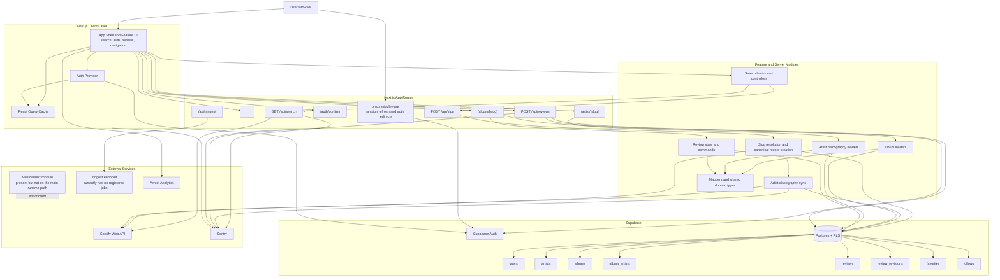

# Architecture

## Tech Stack

| Layer | Technology | Version |
| --- | --- | --- |
| Framework | Next.js (App Router) | 16.1.1 |
| Language | TypeScript | ^5 |
| Runtime | React | 19.1.0 |
| Styling | Tailwind CSS | ^4 |
| UI Components | shadcn/ui (Radix UI) | shadcn ^3.2.1 |
| Backend and Auth | Supabase (PostgreSQL + RLS) | supabase-js ^2.75.0 |
| Server State | TanStack Query | ^5.86.0 |
| Music Data | Spotify Web API | - |
| Background Work | Inngest | ^4.2.6 |
| Observability | Sentry + Vercel Analytics | @sentry/nextjs ^10.46.0 |
| Testing | Vitest + Testing Library | vitest ^4.0.18 |

## Project Structure

- `src/app/` - Next.js App Router routes, layouts, metadata, and API route handlers
- `src/features/` - Feature-owned UI, hooks, server actions, loaders, and tests
- `src/shared/` - Generic UI primitives, utilities, providers, and shared test helpers
- `src/server/` - Server-only adapters for Supabase, Spotify, slug resolution, logging, and database mapping
- `supabase/schemas/` - Declarative schema files used as the database source of truth

## Ownership Rules

- `src/app/` must stay thin and route-focused. Reusable modules do not belong under route folders.
- `src/shared/ui/` contains generic presentational primitives and reusable controls.
- `src/features/*` owns business logic for its product area, including hooks, actions, loaders, and route-facing components.
- `src/server/` contains provider adapters, generated database types, row aliases, slug helpers, and server-only mappers.
- Review writes flow through the authenticated API boundary instead of writing directly to Supabase from the browser.

## System Design

Spinlist treats Spotify as the live discovery source and Supabase as the canonical application store.
Search requests hit Spotify in real time, while route resolution, album pages, artist pages, and review workflows converge onto normalized Supabase records.

## Key Patterns

### Feature-first boundaries

Each feature should be understandable from one folder.
Search, auth, navigation, albums, and reviews own their UI, state, and tests within `src/features/`.

### Separation of concerns

Route files compose feature entrypoints instead of reaching into unrelated folders.
Shared modules stay generic, while feature hooks own stateful workflows and side effects.

Forms with three or more state fields use `useReducer` instead of multiple `useState` calls.

### Layered types

Type boundaries still isolate external APIs, internal contracts, raw database rows, and business models:

1. `src/server/spotify/types.ts` for external Spotify payloads.
2. `src/shared/types/dto/` for app-facing contracts.
3. `src/server/database/` for generated database and row-level types.
4. `src/shared/types/domain/` for business models used by the application.

This keeps provider-specific data models from leaking into product code and makes boundary changes easier to contain.

### Mapper layer

Every boundary crossing goes through pure mappers in `src/server/database/mappers/` or `src/server/spotify/`.
These functions normalize casing, parse JSON-backed fields defensively, and keep transformation logic out of route files and client components.

## Runtime Flows

### Search and navigation

1. The home page keeps search as the primary entry point through `src/features/search/`.
2. Client search state is debounced and cached with TanStack Query before requesting `GET /api/search`.
3. `src/app/api/search/route.ts` calls Spotify directly and maps provider payloads into app-facing DTOs.
4. When a listener chooses a result, the client calls `POST /api/slug` to resolve a canonical application route.
5. Album slug requests can create local album and artist records on demand.
6. Artist slug requests can trigger a synchronous initial discography sync or queue a stale refresh after the response.

### Album page load

1. `src/app/album/[slug]/page.tsx` composes feature loaders for album data and review data.
2. `src/features/albums/server/getAlbum.ts` resolves the album domain model on the server.
3. `src/features/reviews/server/getAlbumReviewFeed.ts` loads recent written reviews for that album from Supabase.
4. Client review UI lives in `src/features/reviews/components/` and `src/features/reviews/hooks/`.

### Artist page load

1. `src/app/artist/[slug]/page.tsx` loads the canonical artist by slug.
2. `src/features/artists/server/getArtistDiscography.ts` reads the stored artist profile and ordered album credits from Supabase.
3. The page renders a discography grid from cached records instead of requesting Spotify directly during page render.

### Review submission

1. The review form updates local reducer state while the user edits fields.
2. Submission and deletion call `src/features/reviews/commands/`.
3. `src/app/api/reviews/route.ts` validates and persists writes through the authenticated server boundary.
4. The relevant user review query invalidates so the UI reloads fresh state.

### Auth and session management

1. `src/proxy.ts` refreshes Supabase sessions during request handling and redirects signed-in users away from guest-only auth routes.
2. `src/app/layout.tsx` bootstraps the initial user and profile on the server.
3. `src/features/auth/hooks/useAuth.tsx` keeps client auth state in sync with Supabase and caches the current profile with TanStack Query.
4. `src/app/auth/confirm/route.ts` verifies email confirmation links and activates pending profiles.

### Observability and background work

1. Sentry is initialized in both server and client runtimes through `src/instrumentation.ts` and `src/instrumentation-client.ts`.
2. API routes and sync workflows capture structured failures through the shared monitoring helpers under `src/monitoring/`.
3. The Inngest route is wired at `src/app/api/inngest/route.ts`, but `src/lib/inngest/index.ts` currently registers no functions.
